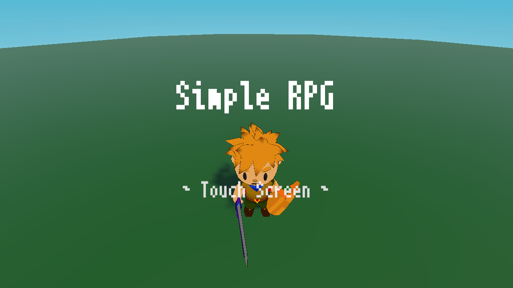
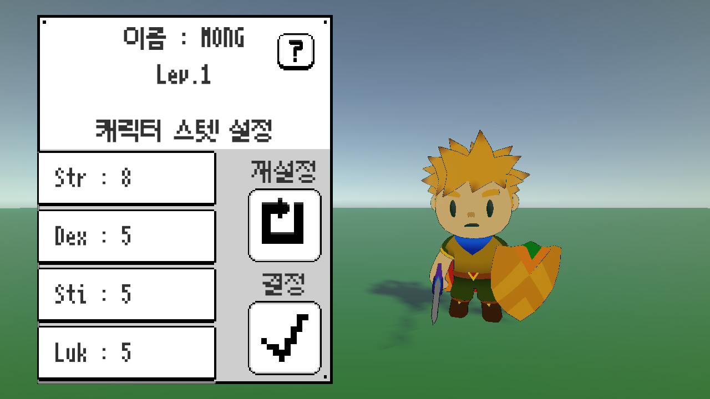
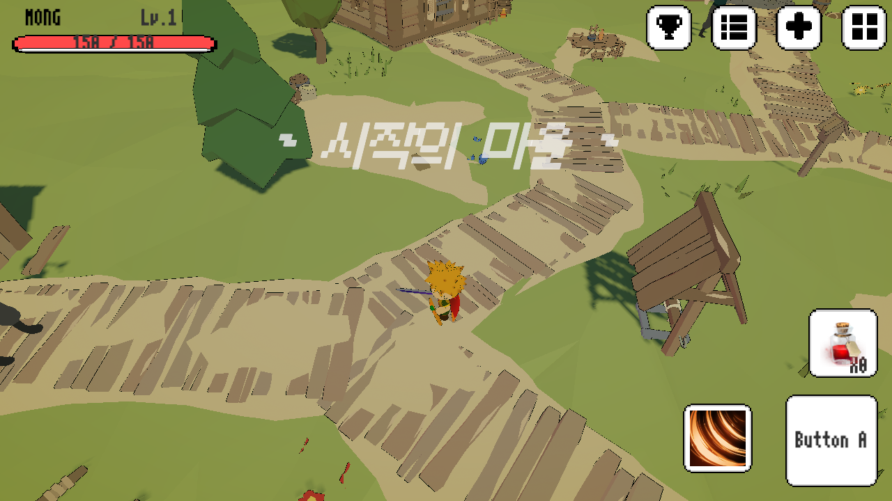
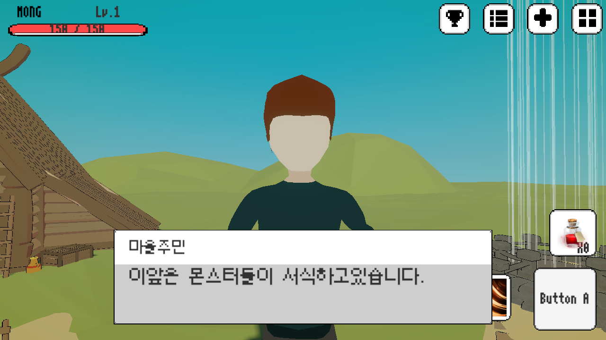
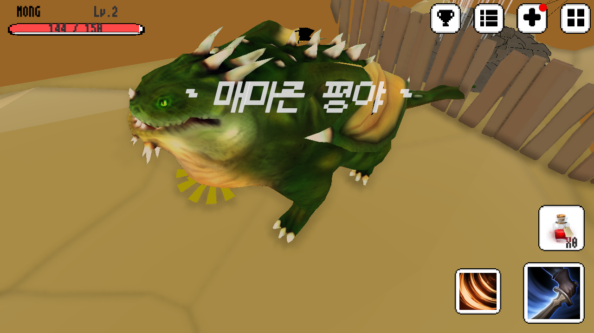

# SimpleRPG
1인 제작 모바일 쿼터뷰 RPG. 기본적인 RPG 시스템(성장/상점/인벤토리/강화/업적)을 빠르게 구현한 3D 프로젝트.

# 스크린샷
 

# 게임 개요

장르: 모바일 쿼터뷰 RPG

개발 인원: 1인

핵심 목표: RPG 장르의 기본 요소를 3D로 구현

핵심 루프: 탐험/전투 → 보상 → 성장(스탯/장비) → 다음 지역/보스

초기 진입: 타이틀 → 저장 데이터 있으면 메인, 없으면 캐릭터 생성

# 주요 기능

- 성장/스탯 시스템

OriginState / AddState / CurState로 스탯을 3계층으로 분리(기본/가산/합산).

레벨업 시 RemainStat(추가 포인트)로 능력치 배분.

- 캐릭터 생성(2단계)

1. 고전식(메이플 유사) 스탯 롤링: 총합 23, 각 스탯 최소 4 / 최대 9. 마지막 스탯에서 합이 23을 넘으면 처음부터 다시.

2. 추가 포인트 9를 1포인트 단위 콜백으로 분배(4개 스탯 버튼).

- 전투/애니메이션

공격 코루틴: 입력 시 공격 애니메이션 재생 → 애니메이션 시간에 맞춰 공격 BoxCollider on/off → 종료 후 Idle 전환.

공격 중 플래그로 중복 입력 방지.

- 적/보스 구조(FSM)

EnemyFSM 추상 베이스(상태 전환/행동 메서드 virtual).

일반 몬스터(예: 슬라임)는 머티리얼 변경으로 피격 연출.

보스(그린드래곤): 전용 UI + 추가 패턴 / Cinemachine으로 등장·사망 연출.

- 데이터 & 저장소

플레이어/아이템/업적 데이터(JSON): 읽기·쓰기 → Application.persistentDataPath.

읽기 전용 JSON(몬스터/기본 설정 등): Assets/Resources/에 배치.

메인 진입 시 저장 데이터로 플레이어 생성/초기화.

맵 이동/포탈

포탈(Trigger) 위에서 일정 시간 유지 → 세이브 후 nextScene 로드 → 새 씬에서 플레이어 재생성.

- 인벤토리 & 상점

OnEnable마다 리스트 리빌드.

상점 오픈/일반 오픈에 따라 판매 버튼 활성/비활성.

판매: 선택 아이템 수량만큼 골드 획득 후 수량 0, 리스트 초기화.

구매: IPointerDown/UpHandler로 클릭 처리, 소지금 ≥ 가격이면 구매.

- 장비 강화(무기)

강화 UI에서 조건 미충족 시 사유 안내.

조건 만족 시 확률 강화 진행, 무기는 강화 단계에 따라 파티클 이펙트 부여.

# 기술 스택

Engine: Unity 2021.3.16f1 (LTS)

Language: C#

Libraries: Newtonsoft.Json, Cinemachine

Input: IPointerDownHandler, IPointerUpHandler

Patterns: Singleton, FSM/State, (C#) Property
